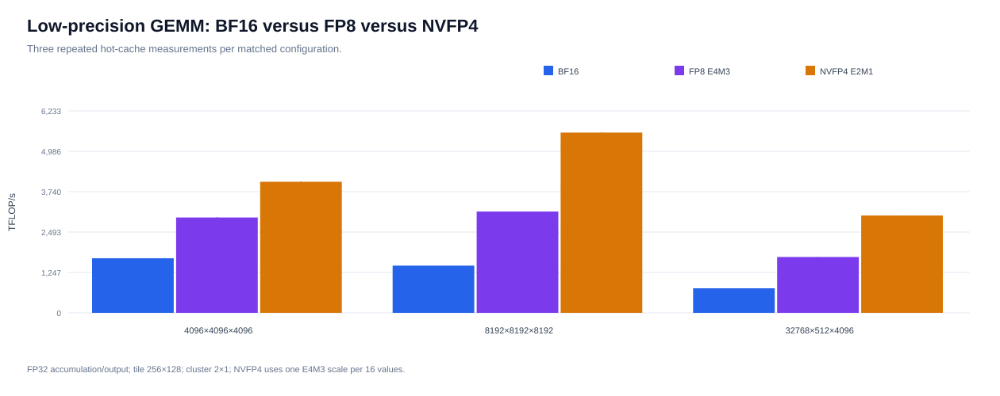

# GB300 Blackwell Microbenchmarks

Five focused experiments on an NVIDIA B300 SXM6 AC: LDGSTS versus TMA, isolated 1-SM versus 2-SM BF16 UMMA, whole-device UMMA scaling, three CuTe DSL GEMM variants versus cuBLASLt, and matched BF16/FP8/NVFP4 GEMMs.

## Results

Experimental acquisition is complete. The five experiments are represented by five CSV summaries and five SVG figures directly in `results/`. The first four experiments summarize three final campaigns using the median within each campaign; the separate precision comparison uses three independently timed repetitions. All statistics are descriptive.

### LDGSTS versus TMA


LDGSTS led in eight of nine configurations. The highest means were 7.026 TB/s for LDGSTS and 6.965 TB/s for TMA. Effective bandwidth is logical useful bytes divided by kernel time; it is not a direct HBM counter.

### Isolated BF16 UMMA


The strongest per-SM configuration was 1-SM UMMA at `N=256`, depth `256`: 16.352 TFLOP/s/SM after applying the measured SM clock. The corresponding 2-SM/1-SM ratio was 1.983.

### Whole-device BF16 UMMA


| Method | Scale | Active SMs | Total TFLOP/s | Per-SM ratio vs. isolated |
|---|---|---:|---:|---:|
| `umma_1sm` | isolated | 1 | 15.022 | — |
| `umma_2sm` | isolated | 2 | 29.611 | — |
| `umma_1sm` | device | 148 | 2242.355 | 1.009× |
| `umma_2sm` | device | 148 | 2233.719 | 1.019× |

The 2-SM launch uses 74 simultaneously resident two-CTA clusters. The final column is an empirical throughput ratio against a separately timed isolated work unit, not a bounded efficiency; clocks were neither locked nor measured concurrently for these launches. Whole-device results use CUDA events; isolated instruction-throughput measurements above use `%clock64`.

### CuTe DSL versus cuBLASLt


| Shape `(M,N,K,L)` | Best CuTe DSL TFLOP/s | cuBLASLt TFLOP/s | Ratio |
|---|---:|---:|---:|
| `4096x4096x4096x1` | 1658.0 | 1749.0 | 94.80% |
| `8192x8192x8192x1` | 1441.8 | 2106.8 | 68.44% |
| `16384x512x4096x1` | 813.5 | 1432.0 | 56.80% |
| `32768x512x4096x1` | 758.7 | 1507.9 | 50.31% |
| `512x16384x4096x1` | 1272.6 | 1498.4 | 84.93% |

`persistent_2cta` was the strongest CuTe DSL variant for every shape. These are hot-cache measurements without kernel-level GEMM profiling.

### BF16 versus FP8 versus NVFP4



`make precision` compares the pinned official persistent CuTe DSL kernels on three shapes: `4096x4096x4096`, `8192x8192x8192`, and `32768x512x4096`. All formats use FP32 accumulation and output, a `256x128` MMA tile, a `2x1` CTA cluster, and TMA stores. NVFP4 uses `Float4E2M1FN` inputs with one `Float8E4M3FN` scale per 16 values.

| Shape `(M,N,K,L)` | BF16 TFLOP/s | FP8 TFLOP/s | NVFP4 TFLOP/s | FP8/BF16 | NVFP4/BF16 | NVFP4 vendor peak |
|---|---:|---:|---:|---:|---:|---:|
| `4096x4096x4096x1` | 1660.1 | 2926.2 | 4040.7 | 1.76× | 2.43× | 29.93% |
| `8192x8192x8192x1` | 1444.8 | 3106.6 | 5585.1 | 2.15× | 3.87× | 41.37% |
| `32768x512x4096x1` | 757.9 | 1727.6 | 3033.3 | 2.28× | 4.00× | 22.47% |

NVFP4 reaches 5.585 PFLOP/s and improves throughput by 2.43–4.00× against the matched BF16 kernel; FP8 improves it by 1.76–2.28×. Against the independently measured cuBLASLt BF16 results above, the NVFP4 ratios are 2.31×, 2.65×, and 2.01×, respectively. The nine measured configurations pass numerical validation, and their coefficients of variation range from 0.061% to 0.452%.

Each configuration uses five warm-up iterations and 20 timed iterations per repetition. Each format verifies its own correctly represented operands before timing; the format-specific operands are not a cross-format model-accuracy comparison. The published dense vendor references are 2250 TFLOP/s for BF16, 4500 TFLOP/s for FP8, and 13500 TFLOP/s for NVFP4; they are comparison references, not measured hardware ceilings. The complete measurements and figure are published in `results/precision_comparison.csv` and `results/precision_comparison.svg`.

## Build and run

The pinned CUDA image, CUTLASS commit and Python package versions are in `VERSIONS.env`.

```bash
make image
make build
export BLACKWELL_GPU_INDEX=7
make smoke
```

Run one short pilot and three complete final campaigns. Final campaigns include the essential Nsight Compute counters:

```bash
make campaign CAMPAIGN_KIND=pilot CAMPAIGN_ID=pilot
make campaign CAMPAIGN_KIND=final CAMPAIGN_ID=final-1
make campaign CAMPAIGN_KIND=final CAMPAIGN_ID=final-2
make campaign CAMPAIGN_KIND=final CAMPAIGN_ID=final-3
```

Generate or replace four CSV summaries and four SVG figures directly in `results/`:

```bash
make analyze FINAL_CAMPAIGNS="final-1 final-2 final-3"
```

Run the independent low-precision extension without repeating the four completed campaigns:

```bash
make precision
```

`make sass` optionally generates the five CUDA disassemblies in `build/sass/`.

## Measurement boundaries

- Numerical correctness is mandatory before timing.
- Each final campaign contains 540 memory samples, 720 isolated UMMA samples, 120 device-scaling samples and 20 GEMM rows.
- Whole-device UMMA requires simultaneous residency and observed coverage of every planned SM.
- The UMMA baseline uses BF16 inputs and FP32 accumulation; GEMM candidates share operands and an untimed IEEE-FP32 reference.
- Nsight Compute provides the DRAM cross-check and measured SM frequency.
- Precision formats share shape, layouts, accumulation/output types, tile, cluster, and store path; scaled NVFP4 operands are format-specific.
- Three campaigns support descriptive statistics, not significance testing or architectural peak claims.
- Independent TMEM/DSMEM latency, dual-die topology, power, and per-launch DVFS measurements are outside the scope of the closed experimental phase.

BSD 3-Clause; see `LICENSE`.
