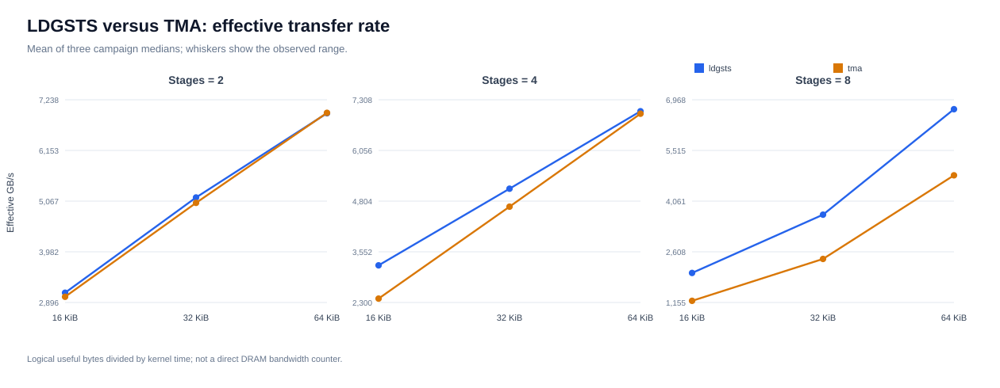
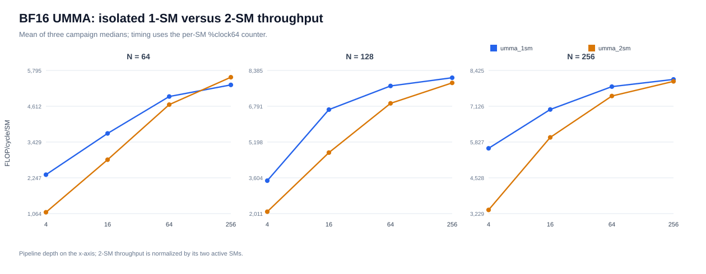
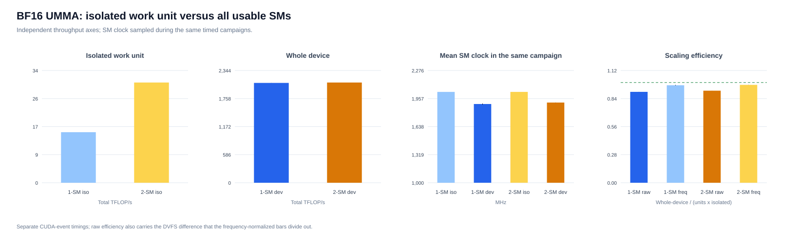
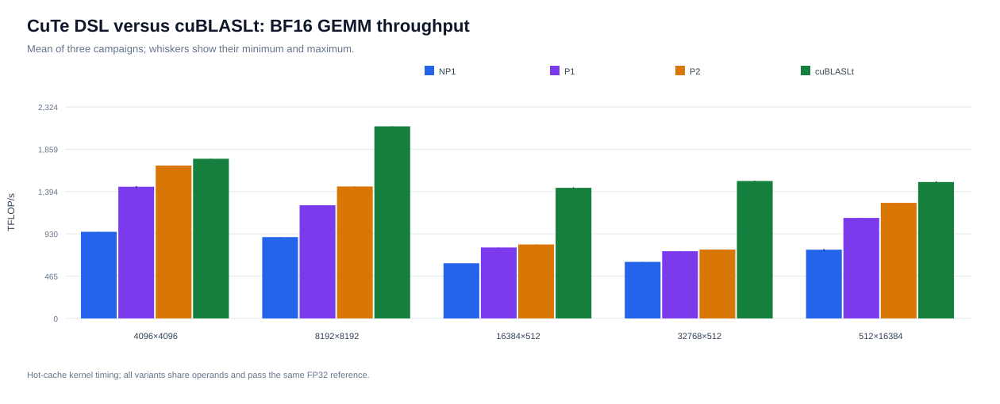

# GB300 Blackwell Microbenchmarks

Four focused experiments on an NVIDIA B300 SXM6 AC: LDGSTS versus TMA, isolated 1-SM versus 2-SM BF16 UMMA, whole-device UMMA scaling, and three CuTe DSL GEMM variants versus cuBLASLt.

## Results

Each published value summarizes three final campaigns. Statistics are descriptive and use the median within each campaign.

### LDGSTS versus TMA



LDGSTS led in eight of nine configurations. The highest means were 7.026 TB/s for LDGSTS and 6.965 TB/s for TMA. Effective bandwidth is logical useful bytes divided by kernel time; it is not a direct HBM counter.

### Isolated BF16 UMMA



The strongest per-SM configuration was 1-SM UMMA at `N=256`, depth `256`: 16.352 TFLOP/s/SM after applying the measured SM clock. The corresponding 2-SM/1-SM ratio was 1.983.

### Whole-device BF16 UMMA



| Method | Scale | Active SMs | Total TFLOP/s | Efficiency |
|---|---|---:|---:|---:|
| `umma_1sm` | isolated | 1 | 15.022 | — |
| `umma_2sm` | isolated | 2 | 29.611 | — |
| `umma_1sm` | device | 148 | 2242.355 | 100.86% |
| `umma_2sm` | device | 148 | 2233.719 | 101.94% |

The 2-SM launch uses 74 simultaneously resident two-CTA clusters. Efficiencies slightly above 100% reflect variation between independently timed isolated and whole-device executions. Whole-device results use CUDA events; isolated instruction-throughput measurements above use `%clock64`.

### CuTe DSL versus cuBLASLt



| Shape `(M,N,K,L)` | Best CuTe DSL TFLOP/s | cuBLASLt TFLOP/s | Ratio |
|---|---:|---:|---:|
| `4096x4096x4096x1` | 1658.0 | 1749.0 | 94.80% |
| `8192x8192x8192x1` | 1441.8 | 2106.8 | 68.44% |
| `16384x512x4096x1` | 813.5 | 1432.0 | 56.80% |
| `32768x512x4096x1` | 758.7 | 1507.9 | 50.31% |
| `512x16384x4096x1` | 1272.6 | 1498.4 | 84.93% |

`persistent_2cta` was the strongest CuTe DSL variant for every shape. These are hot-cache measurements without kernel-level GEMM profiling.

## Build and run

The pinned CUDA image, CUTLASS commit and Python package versions are in `VERSIONS.env`.

```bash
make image
make build
export BLACKWELL_GPU_INDEX=7
make smoke
```

Run one short pilot and three complete final campaigns. Final campaigns include the essential Nsight Compute counters:

```bash
make campaign CAMPAIGN_KIND=pilot CAMPAIGN_ID=pilot
make campaign CAMPAIGN_KIND=final CAMPAIGN_ID=final-1
make campaign CAMPAIGN_KIND=final CAMPAIGN_ID=final-2
make campaign CAMPAIGN_KIND=final CAMPAIGN_ID=final-3
```

Generate or replace four CSV summaries and four SVG figures directly in `results/`:

```bash
make analyze FINAL_CAMPAIGNS="final-1 final-2 final-3"
```

`make sass` optionally generates the five CUDA disassemblies in `build/sass/`.

## Measurement boundaries

- Numerical correctness is mandatory before timing.
- Each final campaign contains 540 memory samples, 720 isolated UMMA samples, 120 device-scaling samples and 20 GEMM rows.
- Whole-device UMMA requires simultaneous residency and observed coverage of every planned SM.
- The UMMA baseline uses BF16 inputs and FP32 accumulation; GEMM candidates share operands and an untimed IEEE-FP32 reference.
- Nsight Compute provides the DRAM cross-check and measured SM frequency.
- Three campaigns support descriptive statistics, not significance testing or architectural peak claims.

The measurement kernels originate from [gb300-gemm-anatomy](https://github.com/Antoniomv7/gb300-gemm-anatomy), commit `86f2382fb92a957035c067ae725e9e25afacab6f`.

BSD 3-Clause; see `LICENSE`.
