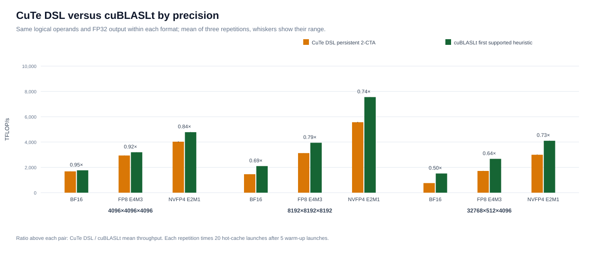

# NVIDIA B300 GEMM Microbenchmarks

Five experiments on one NVIDIA B300 follow GEMM operands from memory to the Tensor Cores and on
to complete GEMMs. They measure how LDGSTS and TMA move data into shared memory (I), how fast
one-SM and two-SM UMMA instructions run (II), how UMMA throughput scales to the whole device
(III), how CuTe DSL BF16 GEMMs compare with cuBLASLt (IV), and how BF16, FP8 and NVFP4 inputs
change GEMM throughput (V). A Nsight Compute profile of DRAM and L2 traffic accompanies
Experiment IV.

Experiments I–III are hand-written CUDA/PTX (`cp.async`, `cp.async.bulk.tensor`, `tcgen05.mma`
with Tensor Memory). Experiments IV and V run pinned CUTLASS CuTe DSL example kernels and
cuBLASLt. `results/` holds the published summaries and figures of this thesis study.

## Platform

| | |
|---|---|
| GPU | NVIDIA B300 SXM6 AC (GB110), compute capability 10.3 (`sm_103a`), 148 SMs, 126.5 MiB L2, ECC enabled |
| Driver and clocks | 610.43.02; 1,100 W power limit; 2,032 MHz maximum SM clock; clocks not locked |
| Container | `nvidia/cuda:13.1.0-devel-ubuntu24.04`, pinned by digest in `VERSIONS.env` |
| GEMM software | CUTLASS `e05f953` (CuTe DSL 4.6.1), cuBLASLt 13.2.0, PyTorch 2.10.0+cu130 |
| Profiler | Nsight Compute 2025.4.0 |

## Experiments

| # | Question | Source | Command |
|---|---|---|---|
| I | Effective global-to-shared transfer rate of LDGSTS versus TMA | `memory_paths/` | `make exp1-memory` |
| II | Isolated BF16 UMMA throughput: one SM versus a two-SM pair | `umma_throughput/umma_1sm.cu`, `umma_2sm.cu` | `make exp2-umma` |
| III | BF16 UMMA throughput from one work unit to all 148 SMs | `umma_throughput/umma_device_scaling.cu` | `make exp3-scaling` |
| IV | BF16 GEMM: three CuTe DSL kernels versus cuBLASLt | `gemm_comparison/` | `make exp4-gemm` |
| V | BF16, FP8 and NVFP4 GEMM: CuTe DSL versus cuBLASLt on identical operands | `precision_comparison/` | `make precision` |
| – | DRAM and L2 traffic of single BF16 GEMM launches (diagnostic) | `scripts/profile_gemm.py` | `make gemm-profile` |

`scripts/run_campaign.py` holds the parameters of Experiments I–IV and runs them.
`analysis/analyze.py` computes every published number from the raw measurements, and
`analysis/figures.py` draws the figures.

### I. Global-to-shared memory paths

`memory_paths/ldgsts.cu` copies 16-byte vectors per thread with `cp.async.cg.shared.global`;
`memory_paths/tma.cu` has one elected thread issue 2-D `cp.async.bulk.tensor` loads that complete
on an mbarrier transaction count. Both share the host code, data pattern and validation kernel in
`memory_paths/memory_common.cuh`.

- One 128-thread CTA on each of the 148 SMs; reserving more than half of the shared memory
  enforces one CTA per SM.
- Grid: 2, 4 or 8 pipeline stages × 16, 32 or 64 KiB in flight per SM.
- A 512 MiB working set, more than twice the L2 size (enforced), is streamed 32 times per launch.
- Metric: effective rate = useful bytes (working set × passes) / kernel time, in GB/s.
- Nsight Compute records DRAM read and write bytes for six configurations.

### II. Isolated UMMA throughput

`umma_1sm.cu` issues `tcgen05.mma.cta_group::1.kind::f16` (M = 128) on one SM; `umma_2sm.cu`
issues the `cta_group::2` form (M = 256) from a two-CTA cluster spanning two SMs. Both accumulate
in Tensor Memory (`tcgen05.alloc`, read back with `tcgen05.ld`); shared code is in
`umma_throughput/umma_common.cuh`.

- Grid: N = 64, 128 or 256 (K = 16) × pipeline depth 4, 16, 64 or 256, the number of dependent
  UMMAs issued between two `tcgen05.commit` mbarrier waits.
- `%clock64` times the elected thread's issue-and-completion loop of 1,000 iterations.
- Metric: FLOP/cycle = 2·M·N·K·UMMAs / cycles, divided by two for the two-SM pair.
- Nsight Compute measures the SM clock of both N = 256, depth-256 kernels; with that clock the
  analysis converts the best per-SM result into a modeled TFLOP/s per SM.

### III. Whole-device UMMA scaling

`umma_device_scaling.cu` runs the N = 256, depth-256 UMMA loop as an isolated work unit (one CTA,
or one two-CTA cluster) and at device scale (148 one-SM CTAs, or 74 two-CTA clusters).

- Before timing, a residency handshake proves that every planned CTA is resident at the same time
  on a distinct SM, one per SM; otherwise the run fails.
- CUDA events time each launch of 1,000 iterations.
- `scripts/gpu_telemetry.py` samples SM clock, power and temperature with `nvidia-smi` every
  50 ms. Samples are attributed to a configuration by host timestamps; each configuration
  needs at least three samples inside its timed launches.
- Metrics: total TFLOP/s; scaling efficiency = device / (work units × isolated); the
  clock-normalized efficiency also divides by the ratio of the mean sampled SM clocks.

### IV. BF16 GEMM implementations

`gemm_comparison/gemm_comparison.py` loads the pinned CuTe DSL examples `dense_gemm.py`
(non-persistent, one CTA, tile 128×128) and `dense_gemm_persistent.py` (persistent, one CTA,
128×128; persistent, two CTAs, 256×128 with a 2×1 cluster). `gemm_comparison/cublaslt_bridge.cu`
provides cuBLASLt with the first supported of up to 32 heuristic algorithms (best-fit search,
64 MiB workspace).

- A (M×K) and B (N×K) are BF16 and K-major; accumulation and output are FP32.
- Shapes: 4096³, 8192³, 16384×512×4096, 32768×512×4096 and 512×16384×4096.
- All candidates share the operands of a shape and one IEEE-FP32 reference.
- Two warm-up launches, then CUDA events time ten launches; TFLOP/s = 2·M·N·K / time.

### V. BF16, FP8 and NVFP4

`precision_comparison/precision_comparison.py` runs the pinned CuTe DSL examples
`dense_gemm_persistent.py` (BF16, FP8 E4M3) and `sm103_dense_blockscaled_gemm_persistent.py`
(NVFP4: E2M1 values with one E4M3 scale per 16 elements). Every kernel uses a 256×128 tile, a 2×1
cluster, a TMA store, FP32 accumulation and FP32 output.

- Shapes: 4096³, 8192³ and 32768×512×4096.
- Per shape and format: three repetitions of 5 warm-up and 20 timed launches, timed by
  `cute.testing.benchmark` with CUDA events and hot caches.
- `cublaslt_precision.py` records the operands that each CuTe DSL repetition creates and encodes
  the same values for cuBLASLt (`cublaslt_precision_bridge.cu`), NVFP4 block scales included in
  cuBLASLt's documented `VEC16_UE4M3` layout. Every operand and scale buffer must be byte-identical
  to the one the CuTe DSL kernel consumed. cuBLASLt uses the first supported heuristic algorithm,
  which must pass `cublasLtMatmulAlgoCheck` with FP32 C and D and must be the same for every
  operand set of a shape and format. cuBLASLt is timed with the same benchmark call.
- After all timing, one PyTorch profiler capture per plan names the cuBLASLt kernel. An empty trace
  is recorded as `UNAVAILABLE`; the algorithm identity and validation remain required.

### GEMM traffic profile

`scripts/profile_gemm.py` profiles the persistent two-CTA CuTe DSL kernel and cuBLASLt on 4096³,
8192³ and 32768×512×4096. Each capture runs its own worker process under `ncu`. The worker repeats
Experiment IV's operand setup, validation and two warm-up launches. It then wraps one launch in the
NVTX range `gb300_gemm_profile`, the only range that `ncu` profiles.

- Hot caches (the study): application replay with `--cache-control none`, so every pass repeats
  setup, validation and warm-up. Cold caches (diagnostic): kernel replay with `--cache-control all`.
  Clocks stay unlocked in both modes.
- Counters: DRAM read and write bytes, duration and SM clock.
- The L2-to-SM TMA read counter `l1tex__m_xbar2l1tex_read_bytes_mem_global_op_tma_ld.sum` is
  collected only when it reproduces, within 0.1%, the useful bytes of a known TMA stream from
  Experiment I.
- Profiler durations are diagnostics; the CUDA-event columns repeat Experiment IV's timing.

## Running the experiments

The host needs an NVIDIA driver, Docker with GPU support, Git, Make and Python 3.9 or newer. Build
the pinned container once, choose an idle B300 and run any experiment:

```bash
make image
export BLACKWELL_GPU_INDEX=6
make exp1-memory     # or exp2-umma, exp3-scaling, exp4-gemm, precision
```

`scripts/run_gpu.sh` resolves the index to the GPU's UUID and refuses a GPU that already runs
compute processes. It exposes only that GPU to the container, as device 0. Every target compiles
as needed and writes one new directory `runs/<target>-<UTC>/`, never an existing one. A run
keeps its samples and validation records in `raw/` and its Nsight Compute reports and CSV exports
beside them. Acquisition requires committed sources and checks that the commit is unchanged at
completion. Its `metadata.json`, written only when the run completes, records the clean Git commit,
the GPU and driver, the CUDA, Nsight Compute, CUTLASS and Python package versions, the parameters
and UTC timestamps.

Experiments I–III report per-launch samples; Experiment IV reports one mean launch time per
candidate and shape. Their published summaries need three campaigns (see [Statistics](#statistics)).
`make precision` also writes its two summaries and figures to `analysis/` inside its run directory.

### The complete study

```bash
make final-study
```

The target builds once and then runs six commands; the first failure stops it:

| Step | Output under `runs/study-<UTC>/` |
|---|---|
| Experiments I–IV, three independent campaigns | `campaign-1/`, `campaign-2/`, `campaign-3/` |
| Experiment V | `precision/` |
| Hot-cache GEMM traffic profile | `gemm-profile-hot/` |
| `analysis/analyze.py --study` on the CPU | `analysis/`: the thirteen files that `results/` publishes |

Use `make final-study 2>&1 | tee study.log` to keep a log. The underlying targets are
`make campaign`, `make analyze CAMPAIGNS="dir1 dir2 dir3"` and
`make gemm-profile PROFILE_CACHE=hot|cold GEMM_SUMMARY=.../gemm_comparison.csv`.

## Validation and controls

- **Correctness before timing.** Each configuration's output is validated before any timed launch
  counts. Experiment I compares every transferred vector with its generated pattern. Experiments
  II and III use small integer operands, whose FP32 accumulation is exact, and compare every
  accumulator element. Experiment IV compares every candidate with the IEEE-FP32 reference
  (|error| ≤ 0.1 + 10⁻⁵·|reference|).
- **Every Experiment V repetition.** CuTe DSL validates an initial launch per shape and format;
  all retained repetition outputs are checked after the example runs. cuBLASLt validates before
  and after each timed repetition. Both are compared with the IEEE-FP32 product of the dequantized
  operands. The absolute tolerance is 0.1; the relative tolerance is 10⁻³ for BF16 and FP8 and 10⁻²
  for NVFP4. A negative control confirms that the check rejects a perturbed value. The run fails
  if any check, operand-byte comparison or cuBLASLt algorithm condition fails.
- **Complete data.** A campaign keeps an experiment's samples only if every configuration produced
  its full set: 540 memory, 720 UMMA, 120 scaling and 20 GEMM rows. CUDA calls are checked
  throughout.
- **Warm-up.** Warm-up precedes timing: 2 s (I), 10 launches (II, III), 2 launches (IV) and 5
  launches per repetition (V).
- **Profiling apart from timing.** Nsight Compute runs after the timed launches, or in separate
  processes, and never changes a timing.
- **Isolation.** The GPU must be idle, and existing run directories are never overwritten.
- **Saved-data validation.** Analysis requires completed runs from clean sources and one GPU and
  source commit across all inputs. Experiment V rechecks the complete sets of repetitions,
  validation records, identical operand bytes (including NVFP4 scales) and cuBLASLt plans.
  A standalone GEMM profile requires its timing summary's adjacent analysis metadata.

## Statistics

For Experiments I–III, each campaign reduces the 30 launches of a configuration to their median.
Experiment IV times a block of ten launches with CUDA events and divides by ten to obtain the mean
launch time, then computes throughput from that time. For Experiments I–IV, the three independent
campaigns give a mean, a sample standard deviation and a coefficient of variation (CV); the CSVs
keep the three campaign values. Ratios such as TMA/LDGSTS or scaling efficiency are computed within
each campaign and then averaged. Experiment V reports the mean, sample standard deviation and CV
of its three repetitions. All statistics are descriptive.
The largest CV among the Experiment I–IV summaries is 0.8%.

## Published results

`results/` holds the CSV summaries and SVG/PDF figures from the final study
`study-20260924T140749Z`, measured on GPU
`GPU-619f7fdc-5f98-8c37-fe89-0465d6130baf`. The complete console log is tracked as
[`study-20260924T140749Z.log`](study-20260924T140749Z.log). Figures show means; whiskers show
the range of the three campaigns or repetitions. These measurements characterize this GPU,
software stack and configuration grid; they are not architectural peak specifications.

### Key findings

| Mechanism | Main observation |
|---|---|
| Global-to-shared movement | LDGSTS is faster than TMA in 8/9 tested configurations; both peak near 7.0 TB/s effective rate at 4 stages and 64 KiB in flight. |
| UMMA issue throughput | The best one-SM case reaches 8,101 FLOP/cycle/SM; a two-SM work unit delivers 1.982× the one-SM total throughput. |
| Device scaling | Two-SM work units reach 2,119.9 TFLOP/s across 148 SMs, with 93.2% raw and 98.1% clock-normalized scaling efficiency. |
| BF16 GEMM | The persistent 2-CTA CuTe DSL kernel is the fastest CuTe variant for every tested shape, reaching 50.3–95.0% of the corresponding cuBLASLt throughput. |
| Low precision | Relative to the CuTe DSL BF16 kernel, FP8 reaches up to 2.27× and NVFP4 up to 3.97× higher throughput on the tested shapes. |
| GEMM traffic diagnostic | For the two shapes with the largest BF16 performance gaps, the CuTe DSL kernel also produces substantially more hot-cache DRAM traffic than cuBLASLt; the counters show correlation, not causation. |

### I. HBM-to-shared-memory paths


LDGSTS reaches the higher effective rate in **8 of 9** stage and in-flight-byte configurations.
The highest means are **7,024.5 GB/s** for LDGSTS and **6,964.2 GB/s** for TMA, both at four stages
and 64 KiB in flight. At two stages and 64 KiB, TMA is marginally higher: **6,954.6 versus
6,951.8 GB/s**. More bytes in flight help both paths in this grid, while eight stages reduce
throughput substantially, most strongly for TMA. The DRAM counters read approximately one byte
per useful byte in all six captured configurations. Source:
[`results/memory_paths.csv`](results/memory_paths.csv).

### II–III. UMMA instruction throughput and device scaling


At N = 256 and depth 256, the isolated one-SM kernel reaches **8,101 FLOP/cycle/SM**, a modeled
**16.377 TFLOP/s/SM** at the measured clock. The two-SM kernel reaches **8,028 FLOP/cycle/SM**,
or **1.982×** the total throughput of the one-SM kernel.


| Execution | Active SMs | Mean throughput | Scaling efficiency | Clock-normalized efficiency |
|---|---:|---:|---:|---:|
| One-SM work units | 148 | 2,104.1 TFLOP/s | 91.7% | 97.3% |
| Two-SM work units | 148 | 2,119.9 TFLOP/s | 93.2% | 98.1% |

Two-SM work units deliver about **0.8%** more device throughput. The isolated units ran at the
2,032 MHz maximum clock; the device-scale measurements averaged about **1,915 MHz** for one-SM
work units and **1,931 MHz** for two-SM work units. The gap between raw and clock-normalized
efficiency shows why a fixed-clock extrapolation from one SM overstates the scaling loss.
Sources: [`results/umma_throughput.csv`](results/umma_throughput.csv) and
[`results/umma_device_scaling.csv`](results/umma_device_scaling.csv).

### IV. BF16 GEMM implementation and shape


| GEMM shape (M × N × K) | Persistent 2-CTA CuTe DSL | cuBLASLt | CuTe DSL / cuBLASLt |
|---|---:|---:|---:|
| 4096 × 4096 × 4096 | 1,671.6 TFLOP/s | 1,758.8 TFLOP/s | 95.0% |
| 8192 × 8192 × 8192 | 1,447.3 TFLOP/s | 2,109.7 TFLOP/s | 68.6% |
| 16384 × 512 × 4096 | 814.9 TFLOP/s | 1,434.8 TFLOP/s | 56.8% |
| 32768 × 512 × 4096 | 758.2 TFLOP/s | 1,508.5 TFLOP/s | 50.3% |
| 512 × 16384 × 4096 | 1,270.3 TFLOP/s | 1,498.7 TFLOP/s | 84.8% |

The persistent 2-CTA kernel is the fastest of the three CuTe DSL variants on all five shapes, but
its distance to cuBLASLt depends strongly on matrix shape. The near-square 4096³ case reaches
**95.0%** of cuBLASLt, whereas the 32768 × 512 × 4096 case reaches **50.3%**. Source:
[`results/gemm_comparison.csv`](results/gemm_comparison.csv).

### V. BF16, FP8 and NVFP4 GEMM


| GEMM shape (M × N × K) | BF16 CuTe DSL | FP8 CuTe DSL | NVFP4 CuTe DSL |
|---|---:|---:|---:|
| 4096 × 4096 × 4096 | 1,681.3 | 2,936.8 (1.75×) | 4,029.0 (2.40×) |
| 8192 × 8192 × 8192 | 1,458.5 | 3,125.0 (2.14×) | 5,572.2 (3.82×) |
| 32768 × 512 × 4096 | 756.7 | 1,718.5 (2.27×) | 3,001.5 (3.97×) |

Throughputs are in TFLOP/s; parentheses give the speedup over BF16 on the same shape. Lower
precision raises throughput substantially, but the gain is shape-dependent and remains below the
ratio of the nominal dense peaks in several cases. NVFP4 also changes the operand representation
through block scaling, so its numerical and data-movement behavior is not directly equivalent to
BF16 or FP8.



On identical operands, CuTe DSL reaches **49.9–95.1%** of cuBLASLt's throughput in BF16,
**64.3–92.1%** in FP8 and **73.3–84.2%** in NVFP4. Every timed output of both implementations
passed validation. The highest measured cuBLASLt throughput in this comparison is **7,545.6
TFLOP/s** for NVFP4 on 8192³. Sources:
[`results/precision_comparison.csv`](results/precision_comparison.csv) and
[`results/precision_cutedsl_vs_cublaslt.csv`](results/precision_cutedsl_vs_cublaslt.csv).

### Hot-cache BF16 GEMM traffic

In the six profiled launches, the persistent 2-CTA CuTe DSL kernel reads more DRAM bytes than
cuBLASLt at 8192 × 8192 × 8192 (**3.33 versus 1.16 GB**) and at 32768 × 512 × 4096
(**1.08 versus 0.28 GB**). The calibrated L2-to-SM TMA counter also records more bytes for CuTe
DSL at those shapes. These are the same shapes where the BF16 throughput gap is largest, which
supports a data-movement interpretation, but the aggregate counters do not identify which operand
was reread and do not prove that traffic alone caused the performance difference.
`compulsory_read_bytes` is the combined A and B size; with hot caches, DRAM reads can be smaller
than this quantity. Source: [`results/gemm_profile.csv`](results/gemm_profile.csv).

## Reproducing the analysis

The final study was executed as `study-20260924T140749Z`; its tracked
[`study-20260924T140749Z.log`](study-20260924T140749Z.log) records the complete command sequence
and successful completion of the three campaigns, precision experiment, hot-cache GEMM profile and
analysis step. The raw `runs/` directory is intentionally not tracked by Git, so exact
regeneration of these particular CSV values requires the corresponding raw study directory.

To run the same protocol again and regenerate its summaries:

```bash
make final-study 2>&1 | tee study.log
make regenerate STUDY=runs/study-<UTC>
```

`analysis/analyze.py --study` produces the seven CSV summaries and six SVG figures. The PDF files
in `results/` are derived exports of those six SVG figures.

## Limitations

- One GPU in one system: the results describe this B300 SXM6 AC, driver, software stack and
  configuration grid, and are not architectural peaks.
- Clocks are not locked. Throughput includes the operating clock (DVFS), which Experiment III
  samples; its power samples are indicative telemetry, not a calibrated energy measurement.
- The GEMM measurements reuse operands across launches (hot caches), so the L2 can hold part of
  them.
- Experiment I's effective rate is useful bytes over kernel time, not a DRAM-bandwidth counter or
  a GEMM prediction. Experiment II's TFLOP/s per SM is modeled from cycles and the profiled clock.
- Experiments IV and V compare specific CuTe DSL example kernels with cuBLASLt's first supported
  heuristic algorithm, without autotuning; they do not establish a ceiling for either library.
- The vendor peaks in `precision_comparison.csv` are nominal dense values.
- The traffic profile has one launch per case; aggregate counters cannot attribute rereads to an
  operand.
- Three campaigns or three repetitions support descriptive statistics, not inference.

## Repository layout

| Path | Contents |
|---|---|
| `benchmark_common.cuh` | Device check and argument parsing shared by the CUDA benchmarks |
| `memory_paths/` | Experiment I: LDGSTS and TMA kernels |
| `umma_throughput/` | Experiments II and III: UMMA and Tensor Memory kernels |
| `gemm_comparison/` | Experiment IV driver and its cuBLASLt bridge |
| `precision_comparison/` | Experiment V driver, operand-sharing cuBLASLt baseline and its bridge |
| `scripts/` | Campaign runner, GPU selection, clock telemetry, Nsight Compute captures, GEMM profile, run metadata |
| `analysis/` | Statistics and figures |
| `results/` | Published CSV summaries plus SVG and PDF figures |
| `Dockerfile`, `VERSIONS.env`, `Makefile` | Pinned environment and commands |
| `build/`, `runs/` | Binaries and measurements; not tracked by Git |

## Versions

- `tfm-acquisition` (commit `6868f00`): preserved acquisition snapshot from the earlier
  validated campaign.
- `tfm-final` (commit `4d47d9a`): thesis-release codebase used as the stable reference before
  publishing the final 2026-09-24 measurement set. The subsequent commits update only the
  published measurements, figures, execution log and README; the benchmark and analysis source
  remains unchanged.

BSD 3-Clause; see `LICENSE`.
