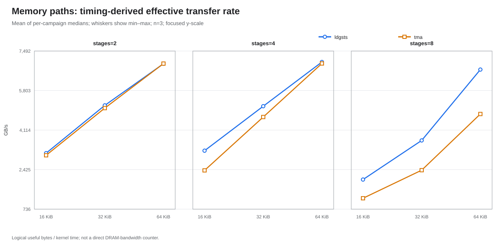
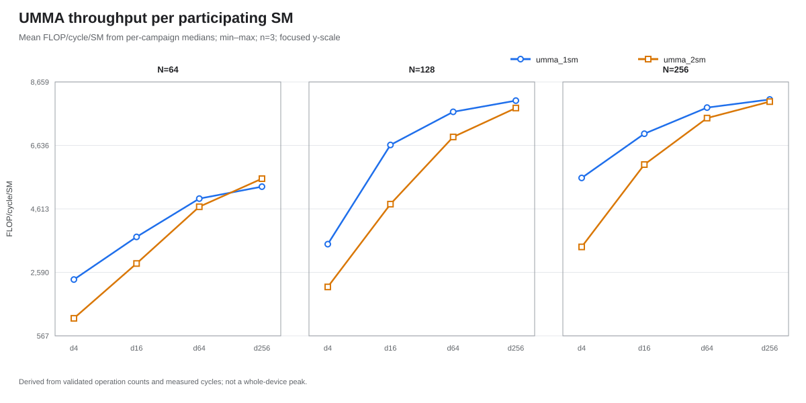
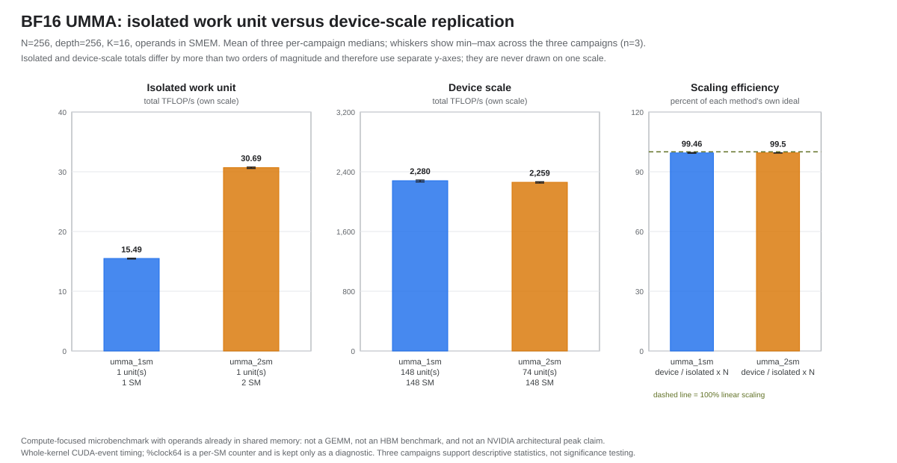
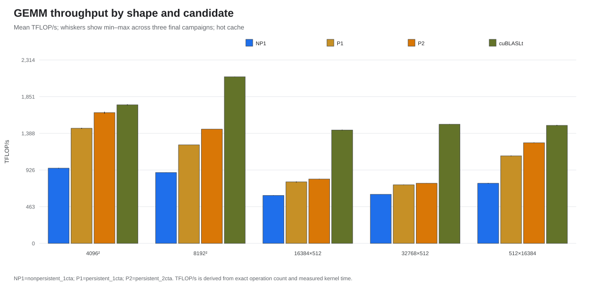

# GB300 Blackwell Microbenchmarks

Minimal, reproducible microbenchmarks for NVIDIA GB300:

| Experiment | Question | Main files |
|---|---|---|
| HBM to SMEM | LDGSTS versus 2D unicast TMA over a fixed pipeline grid | `memory_paths/` |
| BF16 UMMA | 1-SM versus 2-SM `tcgen05.mma` throughput | `umma_throughput/umma_1sm.cu`, `umma_2sm.cu` |
| Whole-device UMMA | Scaling of both UMMA modes from one work unit to all usable SMs | `umma_device_scaling.cu` |
| GEMM | Three CuTe DSL variants versus cuBLASLt on five shapes | `gemm_comparison/` |

The original measurement paths come from [gb300-gemm-anatomy](https://github.com/Antoniomv7/gb300-gemm-anatomy), frozen at commit [`86f2382`](https://github.com/Antoniomv7/gb300-gemm-anatomy/commit/86f2382fb92a957035c067ae725e9e25afacab6f). Their production logic is unchanged; the publication cleanup removed comments and an unused GPU-free GEMM self-test. Whole-device UMMA scaling is a separate supplementary experiment.

## Final results

All published values aggregate three final campaigns by taking each campaign median first and then reporting descriptive statistics across those three medians.

### HBM to SMEM



LDGSTS was higher in eight of nine matched configurations. TMA was slightly higher only at two stages and 64 KiB in flight (ratio `1.00060`). The largest means were `7.024 TB/s` for LDGSTS and `6.962 TB/s` for TMA. No plateau appeared inside the tested 16/32/64 KiB grid.

These rates are `useful_bytes / kernel_time`; they are not direct DRAM-bandwidth counters.

### Isolated BF16 UMMA



The per-SM ceiling candidate was `umma_1sm`, `N=256`, depth `256`, with a modeled mean of `16.354 TFLOP/s/SM` after applying the measured SM clock. At that point the 2-SM/1-SM speedup was `1.983x`. The `2.096x` value at `N=64`, depth `256`, is retained as a diagnostic rather than an architectural claim.

### Whole-device BF16 UMMA



Both device-scale configurations covered all 148 SMs. The 2-SM arm used 74 simultaneously resident two-CTA clusters.

| Method | Scale | Active SMs | Total TFLOP/s | TFLOP/s/SM | Efficiency |
|---|---|---:|---:|---:|---:|
| `umma_1sm` | isolated | 1 | 15.486 | 15.486 | — |
| `umma_2sm` | isolated | 2 | 30.686 | 15.343 | — |
| `umma_1sm` | device | 148 | 2279.568 | 15.402 | 99.46% |
| `umma_2sm` | device | 148 | 2259.351 | 15.266 | 99.50% |

At equal coverage, the whole-device 2-SM total was `0.89%` below the 1-SM total. The maximum throughput coefficient of variation was `0.62%`. These supplementary baselines use CUDA-event timing and the same shared-memory reservation as their device launches; they are not interchangeable with the `%clock64` sweep above.

### CuTe DSL versus cuBLASLt



`persistent_2cta` was the best CuTe DSL variant for all five shapes.

| Shape `(M,N,K,L)` | CuTe DSL TFLOP/s | cuBLASLt TFLOP/s | Ratio | Gap |
|---|---:|---:|---:|---:|
| `4096x4096x4096x1` | 1650.0 | 1749.1 | 94.33% | 5.67% |
| `8192x8192x8192x1` | 1440.8 | 2102.4 | 68.53% | 31.47% |
| `16384x512x4096x1` | 812.2 | 1430.3 | 56.79% | 43.21% |
| `32768x512x4096x1` | 758.2 | 1502.6 | 50.46% | 49.54% |
| `512x16384x4096x1` | 1270.2 | 1488.6 | 85.32% | 14.68% |

These are hot-cache measurements. No GEMM kernel was profiled with Nsight Compute, so the gaps are not attributed to one component.

The four published tables are in `results/*.csv`; the corresponding figures are in `results/figures/`.

## Environment

- NVIDIA B300 SXM6 AC, compute capability 10.3, 148 SMs
- driver 610.43.02
- CUDA toolkit 13.1.0 (`nvcc` 13.1.80)
- CuTe DSL / CUTLASS v4.6.1 at commit `e05f953a...`
- PyTorch 2.10.0+cu130
- target `sm_103a`

Exact image, package and upstream-source pins are in `VERSIONS.env` and `PHASE3_VERSIONS.env`.

## Build and run

```bash
make image
make build
export BLACKWELL_GPU_INDEX=7
make smoke
```

The GPU index must identify one idle physical GPU. Campaigns require a clean worktree and record the commit, GPU, driver and container image.

Collect the primary population:

```bash
make campaign CAMPAIGN_KIND=pilot
make campaign CAMPAIGN_KIND=final
make campaign CAMPAIGN_KIND=final
make campaign CAMPAIGN_KIND=final
```

Aggregate the published primary campaigns:

```bash
make analyze \
  FINAL_CAMPAIGNS="20260822T222634Z 20260822T223050Z 20260822T223504Z" \
  ANALYSIS_OUT=results/new
```

Collect the supplementary population:

```bash
make umma-scaling-build
make umma-scaling-smoke
make umma-scaling-campaign UMMA_SCALING_KIND=pilot
make umma-scaling-campaign UMMA_SCALING_KIND=final
make umma-scaling-campaign UMMA_SCALING_KIND=final
make umma-scaling-campaign UMMA_SCALING_KIND=final
```

Aggregate the published supplementary campaigns:

```bash
make umma-scaling-analyze \
  UMMA_SCALING_FINALS="20260824T122229Z 20260824T122239Z 20260824T122247Z" \
  UMMA_SCALING_ANALYSIS_OUT=results/umma_device_scaling/final
```

`make sass` disassembles the four original CUDA binaries. The accepted disassemblies under `artifacts/sass/` are retained for compiler and instruction-level study.

## Measurement contract

- Numerical correctness is checked before timing.
- Primary campaigns contain 540 memory samples, 720 UMMA samples and 20 GEMM rows.
- Supplementary campaigns contain four configurations by 30 repetitions.
- The device-scale residency probe and recorded SM IDs establish simultaneous coverage.
- Raw evidence is hash-pinned in each campaign manifest; pilots never enter final statistics.
- Nsight Compute is optional and provides the DRAM cross-check and measured SM clock.

The isolated UMMA sweep measures `FLOP/cycle/SM`. The supplementary experiment fixes `N=256`, depth `256`, and measures whole-kernel CUDA-event TFLOP/s for:

- one `cta_group::1` CTA;
- one `cta_group::2` two-CTA cluster;
- one `cta_group::1` CTA per usable SM;
- every simultaneously resident `cta_group::2` cluster.

## Published provenance

| Population | Final campaigns | Execution commit | Analysis manifest SHA-256 |
|---|---|---|---|
| Primary | `20260822T222634Z`, `20260822T223050Z`, `20260822T223504Z` | `1f27767ec9af121103b6d489592a9fd9052bb1b4` | `1fce4eadaf9fc14c548c70128bbcee9979d73a34a7b629a985c9883c0a120a9b` |
| Whole-device UMMA | `20260824T122229Z`, `20260824T122239Z`, `20260824T122247Z` | `060c4aeec4598babf3701c0dcfb74ea15f828585` | `244b93cac3f0f7b6e254867b8a281e70a1e65282288d3bc1ba2a284597283b6b` |

Supplementary pilot `20260824T122221Z` is excluded. Both populations used GPU `GPU-40e00845-d89c-1393-2c32-a2dca3ee9442`, the same driver and the same container image. `provenance/provenance.json` records campaign-manifest hashes, all published-artifact hashes, source identities and preserved-SASS hashes.

## Limitations

- Three final campaigns support descriptive statistics, not significance testing.
- Effective memory GB/s uses logical useful bytes and kernel time.
- The tested memory and isolated-UMMA grids ended before a clear plateau.
- Device-scale UMMA is a compute microbenchmark with operands already in shared memory, not an architectural peak or a complete GEMM.
- GEMM measurements are hot-cache and lack kernel-level profiling.

## License

BSD 3-Clause. See `LICENSE`.
